# FoodHut - Food Ordering System

FoodHut is a full-stack food ordering application that allows users to browse menus, place orders, and make payments online. The application features a modern UI, secure authentication, and real-time order tracking.

## Features

### User Features
- 🔐 User authentication (Login/Register)
- 👤 User profile management
- 🛒 Shopping cart functionality
- 🔍 Food search and filtering
- 💳 Secure payment processing with Stripe
- 📱 Responsive design for all devices
- 📦 Order tracking
- 📧 Email notifications

### Admin Features
- 📊 Admin dashboard
- ✏️ Food item management (Add/Edit/Delete)
- 📋 Order management
- 👥 User management
- 📈 Sales analytics

## Tech Stack

### Frontend
- **React.js** - UI library
- **Tailwind CSS** - Styling
- **DaisyUI** - Component library
- **React Router** - Navigation
- **Axios** - API requests
- **React Context** - State management
- **React Toastify** - Notifications
- **Stripe** - Payment processing

### Backend
- **Node.js** - Runtime environment
- **Express.js** - Web framework
- **MongoDB** - Database
- **Mongoose** - ODM
- **JWT** - Authentication
- **Bcrypt** - Password hashing
- **Nodemailer** - Email services
- **Multer** - File uploads
- **Cloudinary** - Image storage

### Security Features
- Password hashing
- JWT authentication
- Rate limiting
- CORS configuration
- Secure headers (Helmet)

## Getting Started

### Prerequisites
- Node.js (v14 or higher)
- MongoDB
- Stripe account
- Cloudinary account

## Screenshots

### Authentication Section
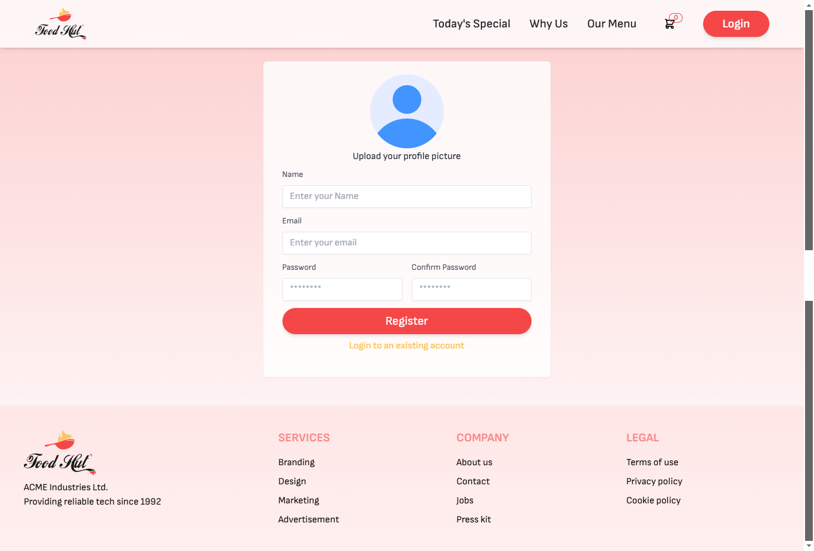
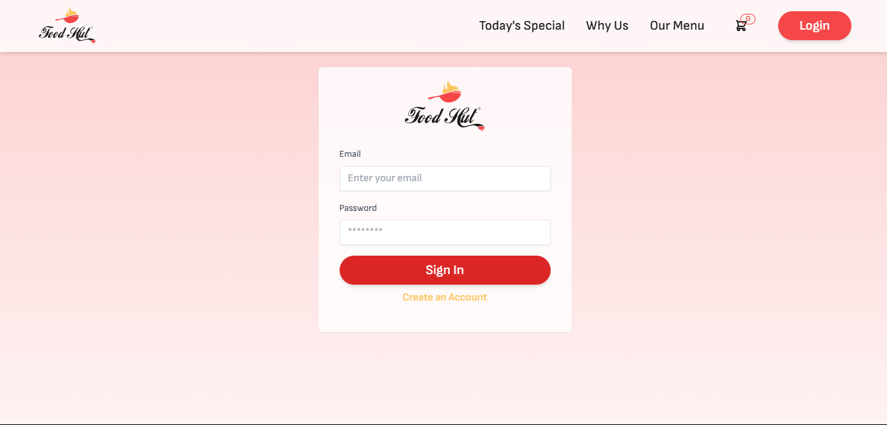

### Home Section

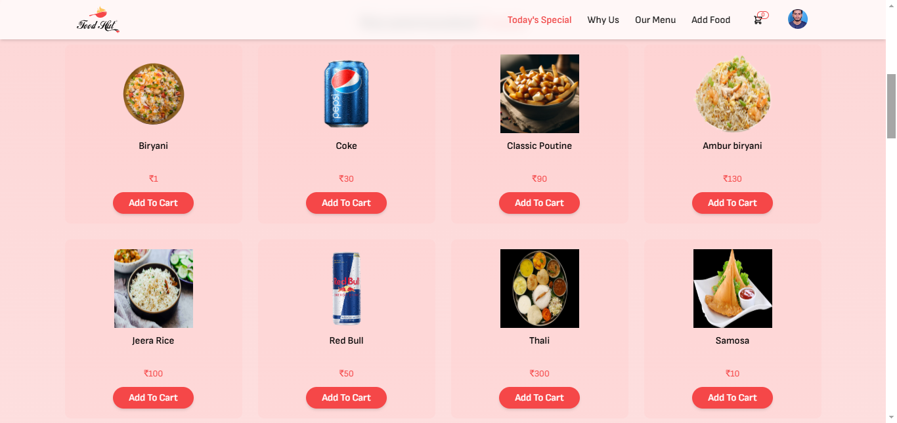
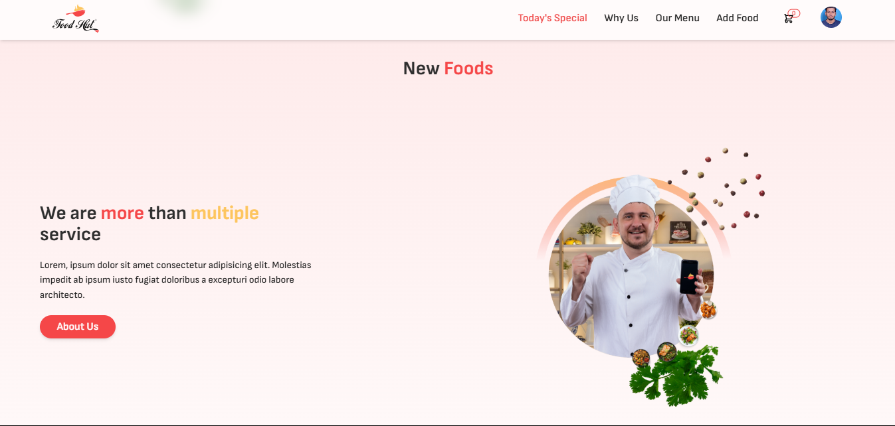
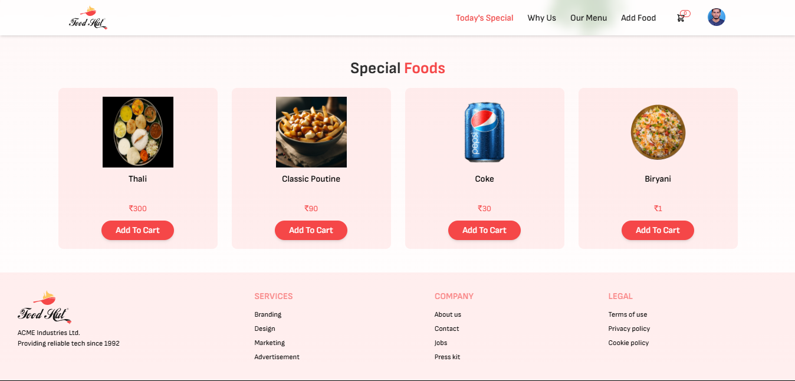

### Food Details Section
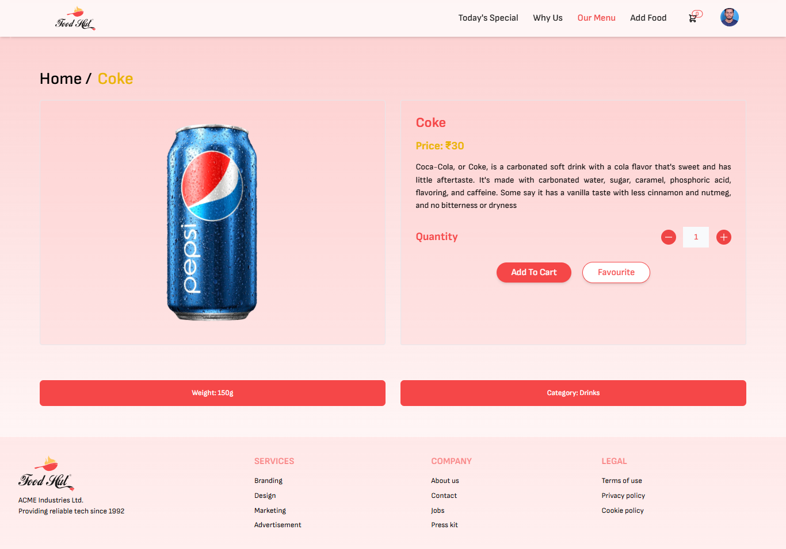

### About Us Section
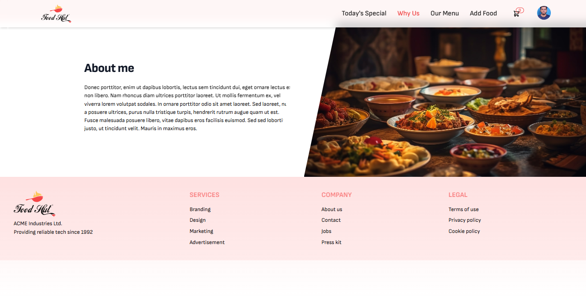

### Categorized Menu Section 
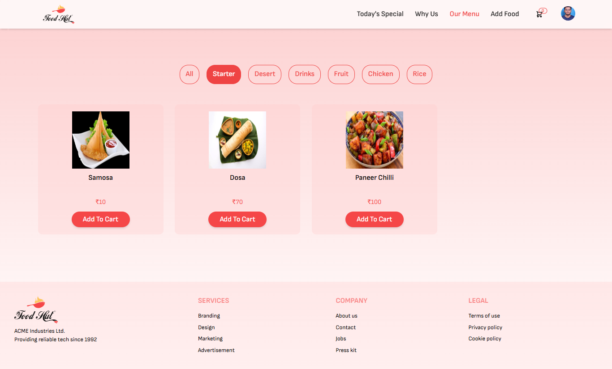

### Add Food Section(Only For Admin)
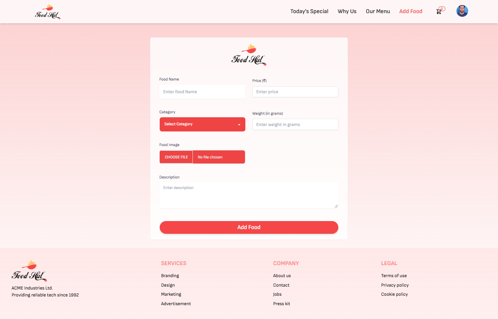

### Cart Section
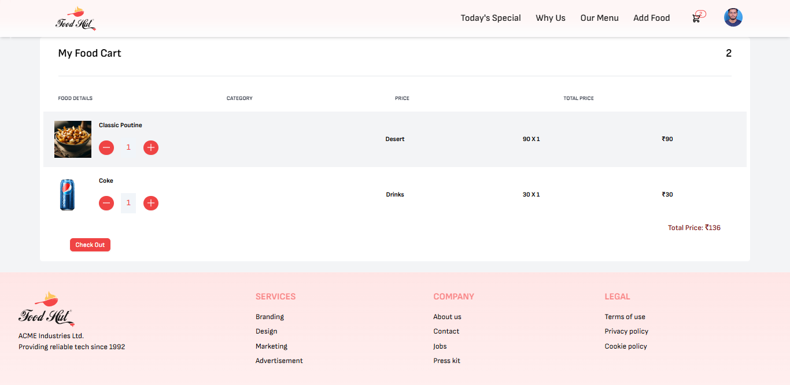

### Checkout Section
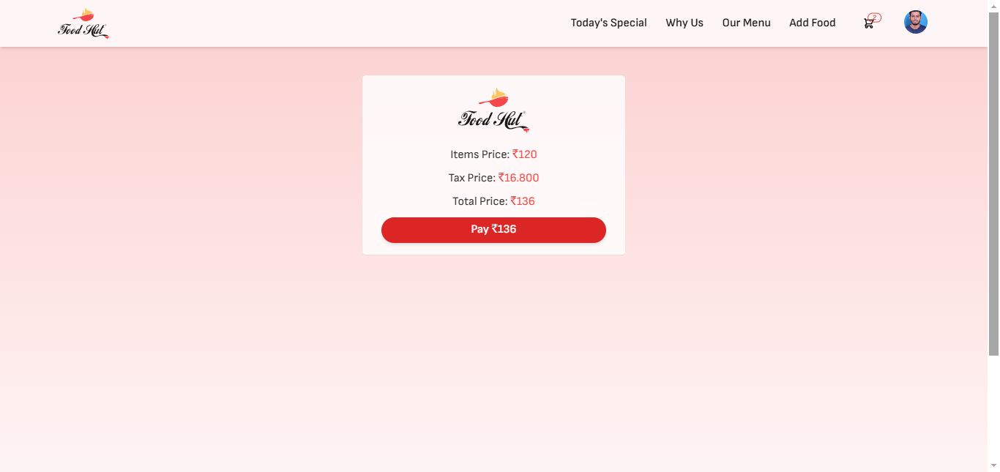

### Payment Section
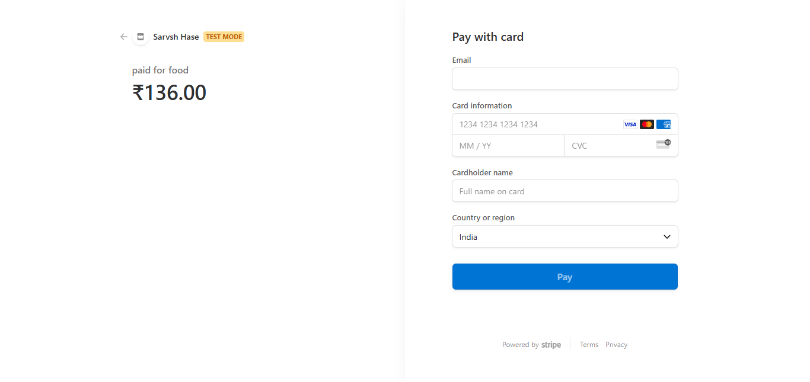

